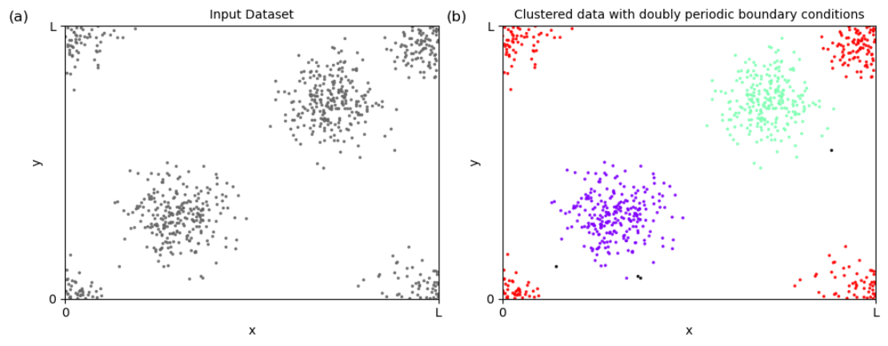

# DBSCAN with Periodic Boundary Conditions

This is a custom implementation of the `DBSCAN` algorithm that supports periodic boundary conditions (PBC).  
It extends the `DBSCAN` class from the `sklearn.cluster` module and adds functionality for handling data in periodic domains.


More information can also be obtained from the corresponding paper:\
de Wit, X. M., &amp; Gabbana, A. (2025). DBSCAN in Domains with Periodic Boundary Conditions. <i>Journal of Open Research Software</i>, <i>13</i>(1), 12. [doi.org/10.5334/jors.555](https://doi.org/10.5334/jors.555).



## Installation

You can install the package using the following command in your terminal or Python environment:  
`pip install git+https://github.com/XanderDW/PBC-DBSCAN.git`

Alternatively:

1. Clone this repository
2. Open a terminal and navigate inside the repository root folder
3. pip install -e .

## Requirements

- python >= 3.7
- scikit-learn >= 1.0

To execute the demo jupyter notebook you will additionally need `numpy`, `matplotlib`, `jupyter`

## Examples

Working examples are provided in the notebook in this repo in the directory `demo-notebooks/`.

## Documentation

```python
class DBSCAN_PBC(DBSCAN):
    """
    DBSCAN with support for Periodic Boundary Conditions (PBC).
    Inherits from sklearn.cluster.DBSCAN.
    """

    def __init__(self, eps=0.5, min_samples=5, metric='euclidean', metric_params=None, 
                 algorithm='auto', leaf_size=30, p=None, n_jobs=None):
        """
        Initialize DBSCAN_PBC.
        
        Parameters:
        - Same parameters as for the plain DBSCAN constructor.
        """

    def fit(self, X, pbc_lower=0, pbc_upper=1, return_padded_dbs=False):
        """
        Fit the DBSCAN model while applying periodic boundary conditions (PBC).

        This method extends the DBSCAN clustering algorithm to work with periodic boundary 
        conditions. It pads the dataset with shifted copies of points near the boundaries,
        runs DBSCAN on the augmented dataset, and then merges clusters that span across 
        the periodic boundaries.

        Parameters
        ----------
        X : array-like of shape (n_samples, n_features)
            The input data points to cluster. Each row corresponds to a data point, 
            and each column represents a feature.

        pbc_lower : scalar or array-like of shape (n_features), default=0
            The lower boundary for each feature in the periodic domain. If scalar, the 
            same lower boundary is applied to all features. If None for a specific dimension, 
            no periodic boundary condition is applied in that dimension.

        pbc_upper : scalar or array-like of shape (n_features), default=1
            The upper boundary for each feature in the periodic domain. If scalar, the 
            same upper boundary is applied to all features. If None for a specific dimension, 
            no periodic boundary condition is applied in that dimension.

        return_padded_dbs : bool, default=False
            If True, additional attributes (`padded_components_`, `padded_labels_`, 
            and `padded_core_sample_indices_`) will be added to the returned DBSCAN 
            model to store results from the padded dataset.

        Returns
        -------
        db : DBSCAN
            The fitted DBSCAN model. The following attributes are available:
            
            - `labels_` : numpy.ndarray of shape (n_samples,)
                Cluster labels for each point in the input dataset. Points labeled as -1 
                are considered noise.
            
            - `components_` : numpy.ndarray of shape (n_core_samples, n_features)
                Core samples of the clusters. 
            
            - `core_sample_indices_` : numpy.ndarray of shape (n_core_samples,)
                Indices of the core samples in the input dataset.
            
            If `return_padded_dbs=True`, the following additional attributes are also 
            added to the model:
            
            - `padded_components_` : numpy.ndarray
                The padded dataset used during clustering (including shifted boundary points).
            
            - `padded_labels_` : numpy.ndarray
                The cluster labels assigned to the padded dataset.
            
            - `padded_core_sample_indices_` : numpy.ndarray
                Core sample indices in the padded dataset.

        Notes
        -----
        - The method ensures the periodic boundary conditions by extending the domain
        with padded points and then merging clusters that span the boundaries.
        - The periodic boundaries for each dimension are defined by `pbc_lower` and 
        `pbc_upper`. If both are None for a dimension, the boundary is treated as open.
        - Input data points are "canonicalized" to the domain `[pbc_lower, pbc_upper]` 
        for clustering, and results are transformed back to the original space.

        Raises
        ------
        ValueError
            If input dimensions, periodic boundary conditions, or parameter types 
            are invalid.

        Example
        --------
        >>> from dbscan_pbc import DBSCAN_PBC
        >>> from sklearn.datasets import make_blobs
        >>> from sklearn.preprocessing import StandardScaler
        >>> import numpy as np
        >>> ### Generate synthetic data
        >>> centers = [[0, 0], [1, 0], [2, 0]]
        >>> X, _ = make_blobs(n_samples=80, centers=centers, cluster_std=0.1, random_state=0)
        >>> X = StandardScaler().fit_transform(X)  # Standardize the data
        >>> L = 2.0  # Box size
        >>> X = np.mod(X, L)  # Apply periodic boundary conditions
        >>> ### Apply DBSCAN_PBC
        >>> db = DBSCAN_PBC(eps=0.1, min_samples=5).fit(X, pbc_lower=0, pbc_upper=L)
        >>> print(db.labels_)

```

## Reference

To reference this work, please cite:\
de Wit, X. M., &amp; Gabbana, A. (2025). DBSCAN in Domains with Periodic Boundary Conditions. <i>Journal of Open Research Software</i>, <i>13</i>(1), 12. [doi.org/10.5334/jors.555](https://doi.org/10.5334/jors.555).

Feel free to use the following bibitem:
```
@article{dewit2025pbcdbscan,
 author = {de Wit, Xander M. and Gabbana, Alessandro},
 doi = {10.5334/jors.555},
 journal = {Journal of Open Research Software},
 month = {Aug},
 title = {{DBSCAN} in Domains with Periodic Boundary Conditions},
 year = {2025},
 volume = {13},
 number = {1},
 pages = {12}
}
```
